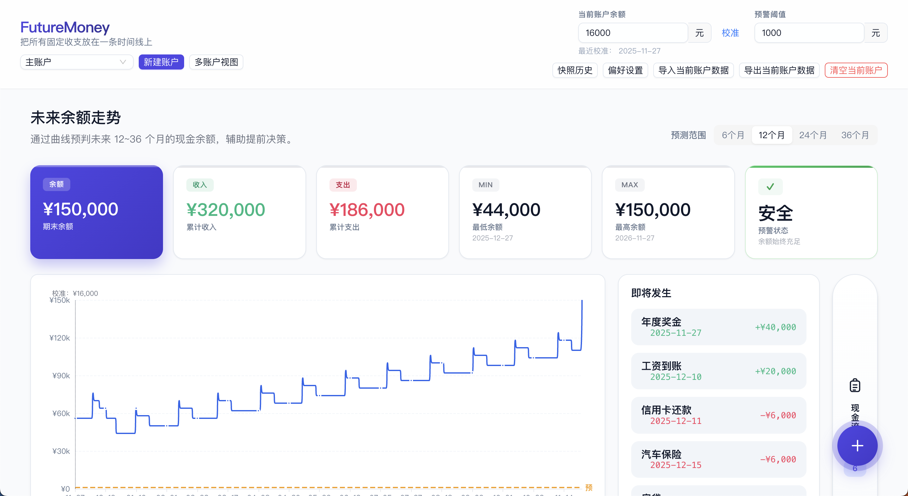

# FutureMoney 💰

一个运行在浏览器中的个人财务规划与“现金流时间线”工具，帮你把所有固定收支放在一条时间线上，看清未来余额走势、风险时点和资金利用效率。

## 在线演示

**[https://future-money.pages.dev](https://future-money.pages.dev)**



## 功能特性

- 💼 **多账户支持**  
  支持同时管理多种账户：现金账户、公积金账户、基金账户、保险账户等；  
  可切换单账户视图编辑数据，也可以切换到多账户汇总视图查看整体资产走势。

- 📸 **余额快照与多次校准**  
  不再只有“初始化金额”一次操作，而是可以在任意日期多次校准当前余额，  
  每次校准都会生成一条“余额快照”，并以最新快照为预测起点。

- 🕒 **历史快照回放**  
  可以从“快照历史”中选择任意一天，切换到该日视角回放当时的预测结果，  
  页面会以只读模式展示当时的时间线和图表，方便对比“之前预测 vs 现在实际”。

- 📊 **可视化预测**  
  以每日为粒度生成未来余额时间线，支持 6 / 12 / 24 / 36 个月范围切换，  
  包括：
  - 未来余额走势折线图（支持周末高亮、预警线标记）
  - 月度收支堆叠柱状图（收入 / 支出 / 结余）
  - 关键指标卡片（期末余额、累计收支、最低/最高余额、预警天数等）

- ⚠️ **余额预警**  
  可为每个账户单独设置预警阈值，图表中会绘制预警线；  
  系统会计算出未来可能跌破预警线的日期，并在指标区集中展示。

- 🔄 **灵活的现金流事件模型**  
  支持三种事件：
  - **一次性事件**：某个特定日期的收入/支出（如：退税、一次性还款）
  - **每月事件**：每月固定日期（如：工资、房贷、房租、信用卡还款）
  - **每年事件**：每年固定日期（如：年终奖、保险费、学费）

- 💾 **纯本地持久化**  
  所有数据自动保存到浏览器 localStorage，不依赖任何后端服务。

- 📥 **导入 / 导出 / 示例数据**  
  - 支持按“当前账户”导入 / 导出 JSON，用于备份或迁移；
  - 可以为当前账户一键载入“示例数据”，快速体验功能。

## 核心概念

### 1. 账户（Account）

你可以为不同资金池创建多个账户，例如：

- 现金账户（工资卡等）
- 公积金账户
- 基金 / 投资账户
- 保险 / 理财账户

在 **单账户视图** 下：

- 可以编辑该账户的余额（校准）、预警阈值、事件列表；
- 导入 / 导出 / 清空操作只作用于当前账户；
- 右下角的「+」按钮可以快速为该账户添加现金流事件。

在 **多账户视图** 下：

- 从多个账户中选择若干个进行汇总展示；
- 图表只显示“一条总资产曲线”，不显示单个账户曲线；
- 事件列表合并显示所有选中账户的事件（带账户小标签）；
- 视图为完全只读，不允许编辑任何账户或事件。

### 2. 现金流事件（Cash Flow Event）

每条事件描述一种固定或一次性的收支行为，并绑定到具体账户：

- **一次性事件**：某个特定日期的收入/支出
- **每月事件**：每月固定日期的收支（如：工资、房贷）
- **每年事件**：每年固定日期的收支（如：年终奖、保险费）

所有事件会被按日展开叠加到时间线上，参与余额预测。

### 3. 余额快照与校准（Balance Snapshot）

现实中的账户余额会不断偏离纯粹的“预测结果”，因此需要定期校准：

- 任意一天都可以通过「校准当前账户余额」弹窗录入真实余额；
- 系统为当前账户在该日生成一条“余额快照”，并以此作为新的预测起点；
- 同一天重复校准只保留一条快照（后者覆盖前者），避免产生同日多条记录。

在“快照历史”中，你可以：

- 按日期浏览所有账户的快照；
- 点击任一条记录切换到对应账户 + 对应日期的**历史快照视图**；
- 历史视图为只读，顶部会有明显提示，可一键返回最新状态。

### 4. 未来余额预测与图表

基于「当前账户 / 选中账户」的最新快照 + 所有事件，系统会：

- 按天生成未来 N 个月的余额时间线（N 可在 6、12、24、36 个月之间切换）；
- 计算各日是否为周末、是否为“今天之前”、是否跌破预警线；
- 从时间线中聚合出月度收支与关键统计指标。

图表区域包括：

- 余额趋势折线图：支持周末背景高亮、预警线标记；
- 月度收支堆叠柱状图（收入 / 支出 / 结余）；
- 即将发生的事件列表（近 60 天）；
- 关键指标卡片（期末余额、累计收入/支出、最低/最高余额、预警天数/日期）。

## 技术栈

- **框架**: Vue 3 (Composition API) + TypeScript
- **构建工具**: Vite
- **状态管理**: Pinia
- **UI 组件**: Ant Design Vue
- **图表库**: Apache ECharts
- **日期处理**: date-fns
- **测试**: Vitest
- **部署**: Cloudflare Pages

## 本地开发

### 环境要求

- Node.js >= 18
- npm >= 9

### 安装依赖

```bash
npm install
```

### 启动开发服务器

```bash
npm run dev
```

访问 http://localhost:3000

### 构建生产版本

```bash
npm run build
```

### 运行测试

```bash
# 运行测试
npm run test

# 监听模式
npm run test:watch
```

### 类型检查

```bash
npm run type-check
```

## 项目结构

```
FutureMoney/
├── docs/                    # 项目文档
├── src/
│   ├── assets/             # 静态资源
│   ├── components/         # Vue 组件
│   │   ├── charts/         # 图表相关组件
│   │   ├── common/         # 通用组件
│   │   └── events/         # 事件管理组件
│   ├── layouts/            # 布局组件
│   ├── stores/             # Pinia 状态管理
│   ├── types/              # TypeScript 类型定义
│   ├── utils/              # 工具函数
│   │   ├── analytics.ts    # 数据分析
│   │   ├── timeline.ts     # 时间轴计算
│   │   └── storage.ts      # 本地存储
│   ├── App.vue            # 根组件
│   └── main.ts            # 应用入口
├── vite.config.ts         # Vite 配置
└── package.json           # 项目配置

```

## 数据存储

所有数据存储在浏览器的 localStorage 中，包括：
- 所有账户配置（名称、类型、预警阈值等）
- 各账户的现金流事件
- 各账户的余额快照（校准记录）
- 用户偏好设置（默认预测范围、图表样式等）

数据不会上传到任何服务器，完全在本地运行，保证隐私安全。

## 浏览器支持

支持所有现代浏览器：
- Chrome / Edge (最新版)
- Firefox (最新版)
- Safari (最新版)

## 许可证

MIT License

## 贡献

欢迎提交 Issue 和 Pull Request！

## 作者

[lipeng3g](https://github.com/lipeng3g)
