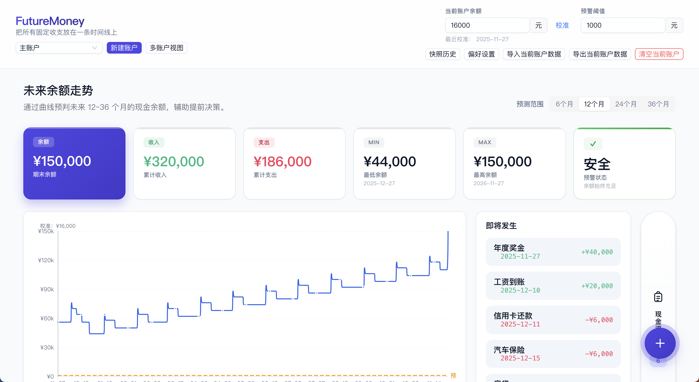

# FutureMoney

个人现金流预测工具。把工资、房贷、信用卡还款等固定收支录入后，自动生成未来余额走势图，提前发现资金缺口。

数据仅存于浏览器本地，无需注册，无需后端。

**在线体验：[https://future-money.pages.dev](https://future-money.pages.dev)**

**源码仓库：[https://github.com/lipeng3g/future-money](https://github.com/lipeng3g/future-money)**

## 为什么做这个

每个月工资到账、房贷扣款、信用卡还款……日子一天天过，但你有没有认真想过：按照现在的收入和消费习惯，三年后我能攒下多少钱？够不够买房买车的首付？

大多数人心里其实没底。我们知道每月赚多少、花多少，却很难把这些数字投射到一两年甚至更长的时间线上，去看看未来的自己到底站在什么位置。

FutureMoney 不追求精确到分的财务计算——生活中总会有计划外的开销，预测一年后有 10 万，实际攒下 8 万，这完全正常。它要做的是给你一个大致的方向感：按照当前的节奏走下去，未来的财务状况大概是什么样的，什么时候可能出现资金缺口，提前心里有数就好。

简单说：不是记账工具，而是一条从今天延伸到未来的财务时间线。



## 功能特性

- **对账系统**
  定期输入真实余额进行对账，系统会冻结历史数据，确保预测始终从真实数据出发。对账时可审核每笔事件是否实际发生，差额自动生成调整记录。

- **现金流事件**
  支持五种频率：一次性、每月、每季度、每半年、每年。录入后自动按日展开到时间线上参与余额计算。一次性事件会额外校验发生日期必须落在起止日期区间内，避免录入后被静默忽略。

- **事件覆盖**
  对未来的预测事件可以单独操作：标记已发生、跳过本期、修改金额，不影响规则本身。

- **多账户管理**
  支持创建多个账户（工资卡、公积金、基金等），可在单账户视图编辑数据，也可切换到多账户汇总视图查看整体资产走势。账户管理面板集成了导入、导出、清空、删除操作。

- **可视化预测**
  - 余额走势折线图：冻结区实线 + 预测区虚线，有事件的日期显示彩色标记点
  - 月度收支堆叠柱状图
  - 关键指标卡片（期末余额、累计收支、预警天数等）
  - 支持 6 / 12 / 24 / 36 个月范围切换

- **余额预警**
  为每个账户设置预警阈值，图表标出预警线，预测到跌破时高亮提醒。

- **AI 财务分析（新）**
  纯前端直连 OpenAI 兼容接口（如 DeepSeek、通义千问等），自动提取本地财务快照进行智能分析。
  - 支持深度思考过程展示（Reasoning Content）
  - 内置四个精选预设分析场景（财务健康度、风险预警、支出优化、收支趋势）
  - 对话记录本地持久化、支持导出完整 Markdown 文件
  - 采用优雅无痕的类文档聊天排版，拒绝廉价 AI 感
  - 本地 Vite 代理解决各类大模型 API 请求的 CORS 跨域痛点

- **现代科技感 UI（新）**
  - 全新升级全局配色系统与卡片风格
  - 引入毛玻璃（Glassmorphism）质感特效
  - 更加平滑丝滑的 ECharts 曲线与定制化悬浮提示框
  - 极简时间轴设计的「即将发生」清单

- **纯本地存储**
  所有核心数据保存在浏览器 localStorage，不依赖后端服务。支持按账户导入/导出 JSON 备份。

## 核心概念

### 对账（Reconciliation）

对账是 FutureMoney 的核心机制，用于将预测与现实对齐：

1. 系统根据事件规则自动生成对账期间内的预期收支明细
2. 你审核每笔记录（确认、删除、修改金额，或手动添加遗漏的收支）
3. 输入当前真实余额，系统自动计算差额并生成调整记录
4. 对账完成后，该期间的数据被冻结，不再受规则修改影响

对账后的历史数据（冻结区）和未来预测数据（预测区）在图表上用不同线型区分。

### 现金流事件（Cash Flow Event）

每条事件描述一种收支规则，绑定到具体账户：

| 频率 | 说明 | 示例 |
|------|------|------|
| 一次性 | 某个特定日期 | 退税、家电采购 |
| 每月 | 每月固定日期 | 工资、房贷、信用卡还款 |
| 每季度 | 每三个月 | 季度体检、季度奖金 |
| 每半年 | 每六个月 | 半年奖、保险费 |
| 每年 | 每年固定日期 | 年终奖、车险 |

### 事件覆盖（Event Override）

对未来预测中的某一期事件进行单次修改，不改变规则本身：

- **标记已发生**：该期不再出现在预测中（已反映在对账余额里）
- **跳过本期**：该期不会触发（比如某月没发工资）
- **修改金额**：该期使用自定义金额（比如信用卡还款金额波动）

## 技术栈

- **框架**: Vue 3 (Composition API) + TypeScript
- **构建工具**: Vite
- **状态管理**: Pinia
- **UI 组件**: Ant Design Vue
- **图表库**: Apache ECharts
- **AI 与渲染**: OpenAI API 规范, Markdown-It
- **日期处理**: date-fns
- **测试**: Vitest
- **部署**: Cloudflare Pages

## 本地开发

### 环境要求

- Node.js >= 18
- npm >= 9

### 安装依赖

```bash
npm install
```

### 启动开发服务器

```bash
npm run dev
```

访问 http://localhost:3000

### 构建生产版本

```bash
npm run build
```

### 运行测试

```bash
# 运行测试
npm run test

# 监听模式
npm run test:watch
```

### 类型检查

```bash
npm run type-check
```

## 项目结构

```
src/
├── components/
│   ├── account/           # 账户管理（创建、多选、管理面板）
│   ├── ai/                # AI 财务助手（对话抽屉、API 配置、打字机流式渲染）
│   ├── charts/            # 图表区域（余额走势、月度收支、即将发生、统计面板）
│   ├── common/            # 通用组件（引导、偏好设置、图标）
│   ├── events/            # 事件管理（表单、卡片、列表）
│   └── reconciliation/    # 对账相关（对账弹窗、横幅、历史记录）
├── layouts/               # 布局（AppHeader、MainLayout）
├── stores/                # Pinia 状态管理
├── types/                 # TypeScript 类型定义
│   ├── event.ts           # 事件与频率类型
│   ├── reconciliation.ts  # 对账、账本条目、事件覆盖
│   ├── timeline.ts        # 时间线快照
│   └── storage.ts         # 持久化结构
├── utils/
│   ├── ai.ts              # AI API 代理封装、上下文抓取与 Prompt 构建引擎
│   ├── reconciliation.ts  # 对账引擎
│   ├── timeline.ts        # 时间线生成器
│   ├── analytics.ts       # 数据分析与统计
│   ├── storage.ts         # 本地存储与数据迁移
│   └── validators.ts      # 事件校验
├── App.vue
└── main.ts
```

## 数据存储

所有数据存储在浏览器 localStorage 中：

- 账户配置（名称、类型标签、预警阈值、颜色）
- 现金流事件规则
- 对账记录与账本条目
- 事件覆盖记录
- 用户偏好设置

数据不会上传到任何服务器。版本升级时会自动迁移旧数据格式（v1 快照 → v2 对账记录）。

## 浏览器支持

支持所有现代浏览器：
- Chrome / Edge (最新版)
- Firefox (最新版)
- Safari (最新版)

## 许可证

MIT License

## 贡献

欢迎提交 Issue 和 Pull Request！

## 作者

[lipeng3g](https://github.com/lipeng3g)
